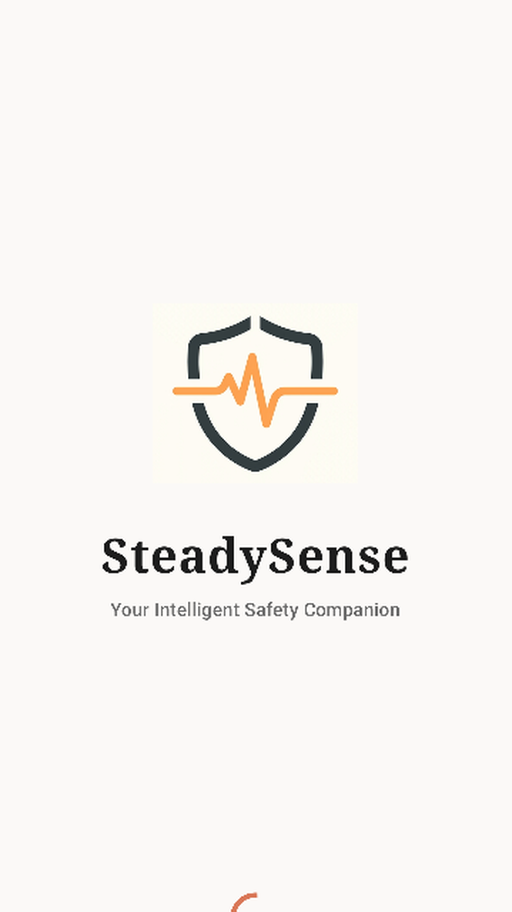
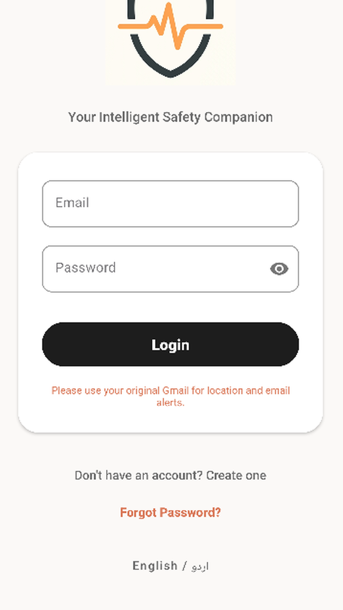
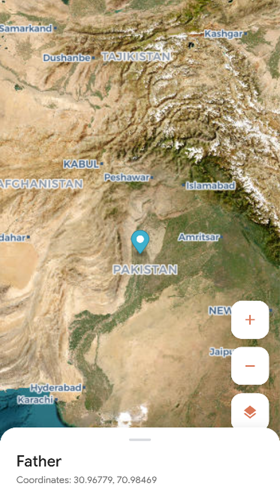
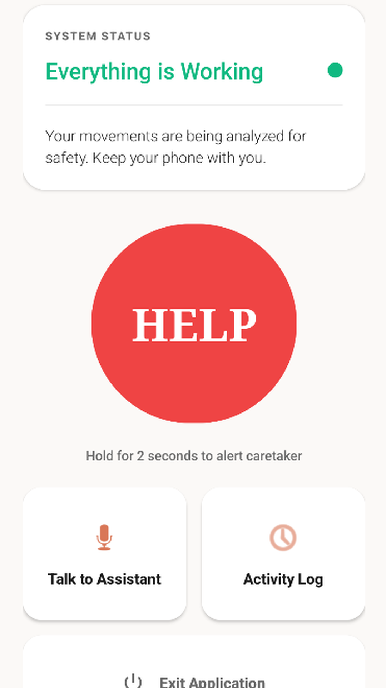
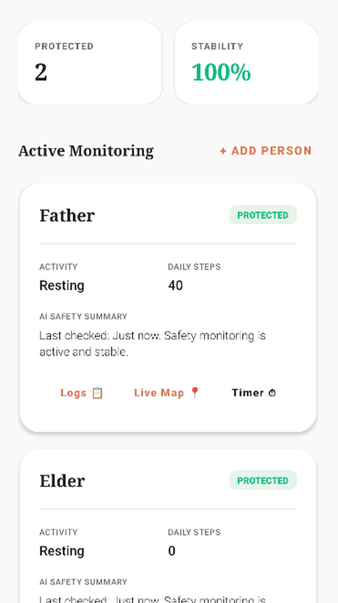
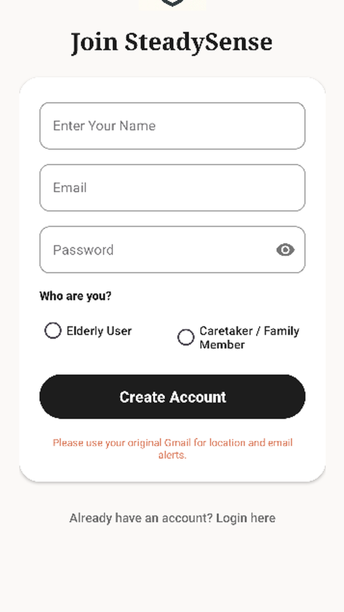
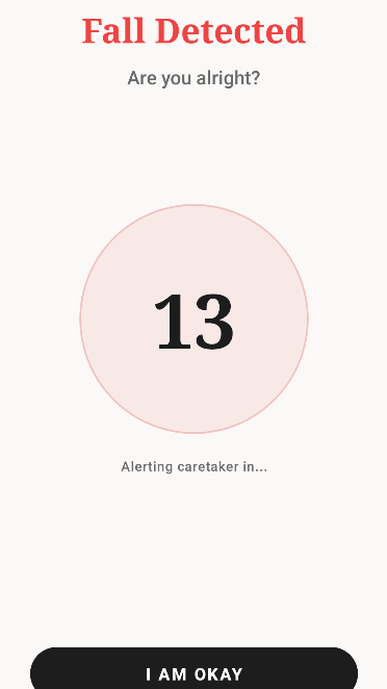
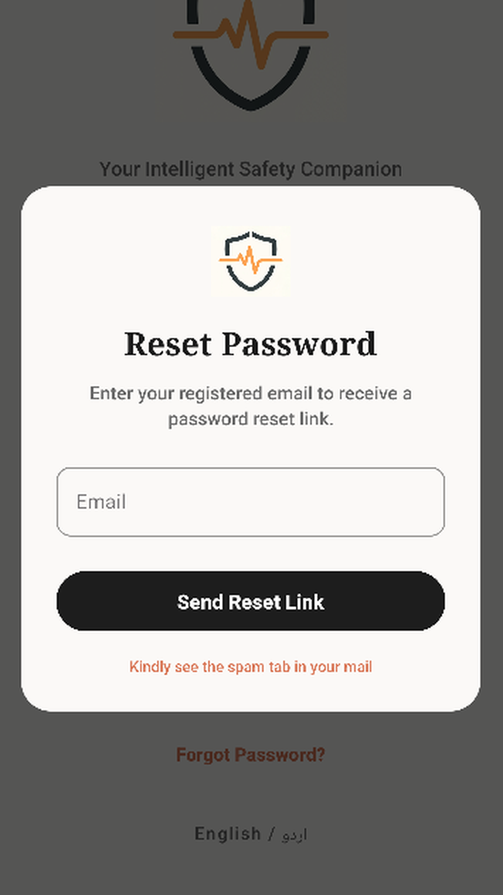

# SteadySense
An intelligent Android app for real-time elder care, fall detection, and secure family monitoring.

## About the App
SteadySense is designed for elderly users and their caretakers, offering automated fall detection, live location tracking, and health activity monitoring. It helps seniors stay independent while ensuring family members receive fast alerts during emergencies. The app is useful for older adults, caretakers, and family members who want reliable remote monitoring. Key features include emergency alerts, real-time maps, AI voice assistance, and secure caretaker linking.

## App Screenshots
| Splash Screen | Login Screen | Map Screen |
|--------------|--------------|------------|
|  |  |  |

| Elder Dashboard | Caretaker Dashboard | Signup Screen |
|-----------------|---------------------|---------------|
|  |  |  |

| Fall Trigger | Forgot Password | (more) |
|------------|----------------|-------|
|  |  | |

## Features
- Elder and caretaker registration
- User login and secure authentication
- Automatic fall detection using device sensors
- SOS emergency alert with location sharing
- Real-time caregiver dashboard and elder monitoring
- Interactive map view for location tracking
- AI voice assistant with English and Urdu support
- Firebase Authentication, Firestore, and messaging integration

## Technologies Used
- Java
- Android Studio
- XML layouts
- Firebase Auth, Firestore, Messaging, Analytics
- Google Play Services Location
- MapLibre-compatible map rendering
- Google Gemini API for voice assistance
- Gradle build system

## APK Download
[Download APK](apk/SteadySense.apk)

## How to Install the APK
1. Download the APK file.
2. Open the APK file on an Android device.
3. Allow installation from unknown sources if required.
4. Install and run the application.

## How to Run the Project
1. Clone or download this project.
2. Open the project in Android Studio.
3. Sync Gradle files.
4. Connect Firebase if required.
5. Run the app on an emulator or Android device.

## App Permissions
SteadySense requires several device permissions to provide fall detection, location sharing, and voice assistance. Below is a summary of the permissions requested and why they're needed:

- `ACCESS_FINE_LOCATION` / `ACCESS_COARSE_LOCATION`: Precise and approximate location for emergency sharing and map display.
- `ACCESS_BACKGROUND_LOCATION`: Needed to continue location updates when the app is running in the background for emergency tracking.
- `ACTIVITY_RECOGNITION`: Required to detect movement patterns and count steps for activity monitoring and fall detection.
- `RECORD_AUDIO`: Required for the AI Voice Assistant to capture voice commands (audio is processed and not stored as raw recordings).
- `POST_NOTIFICATIONS`: (Android 13+) Allow the app to deliver emergency and system notifications to caretakers and elders.
- `FOREGROUND_SERVICE`: Allows the app to run a foreground service for continuous monitoring (fall detection) without being killed by the system.
- `INTERNET`: Required for Firebase, voice AI (Gemini) and map services.

How to grant permissions:
1. The app will prompt for permissions at runtime when needed.
2. To enable permissions manually: `Settings` -> `Apps` -> `SteadySense` -> `Permissions`.
3. To ensure continuous monitoring, disable battery optimization for the app: `Settings` -> `Battery` -> `Battery Optimization` -> `SteadySense` -> `Don't optimize`.

## Demo Video
[Watch Demo Video](https://drive.google.com/file/d/1gQv-IG3dDVZMQ8c7aYBprSmZLbUe9ZQW/view?usp=sharing)
 
## Privacy Policy
[View Privacy Policy](https://delicate-froyo-10153b.netlify.app/)

## Future Enhancements
- Add smartwatch integration
- Improve UI design and accessibility
- Add notifications for health reminders
- Add advanced analytics and reports
- Add admin panel for health professionals

## Developed By
- Maher Sachal
- Semester 6th
- Computer Science / Information Technology
- GitHub: https://github.com/SachalVerse/SteadySense
- LinkedIn: https://www.linkedin.com/posts/maher-sachal-736652353_androiddev-java-firebase-ugcPost-7465445276804112386-Gy1e/?utm_source=share&utm_medium=member_desktop&rcm=ACoAAFgx3poBW6ZZ3Q4OuyZFb1EWad0OJQI8Cm8

## Project Structure
- `app/src/main/java/com/example/steadysense/` - Java source code for activities, adapters, helpers, models, and services
- `app/src/main/res/layout/` - XML UI layout files
- `app/src/main/res/values/` - Strings, themes, and styles
- `app/src/main/AndroidManifest.xml` - App manifest and permissions
- `app/build.gradle.kts` - Module Gradle configuration
- `settings.gradle.kts` - Project settings
